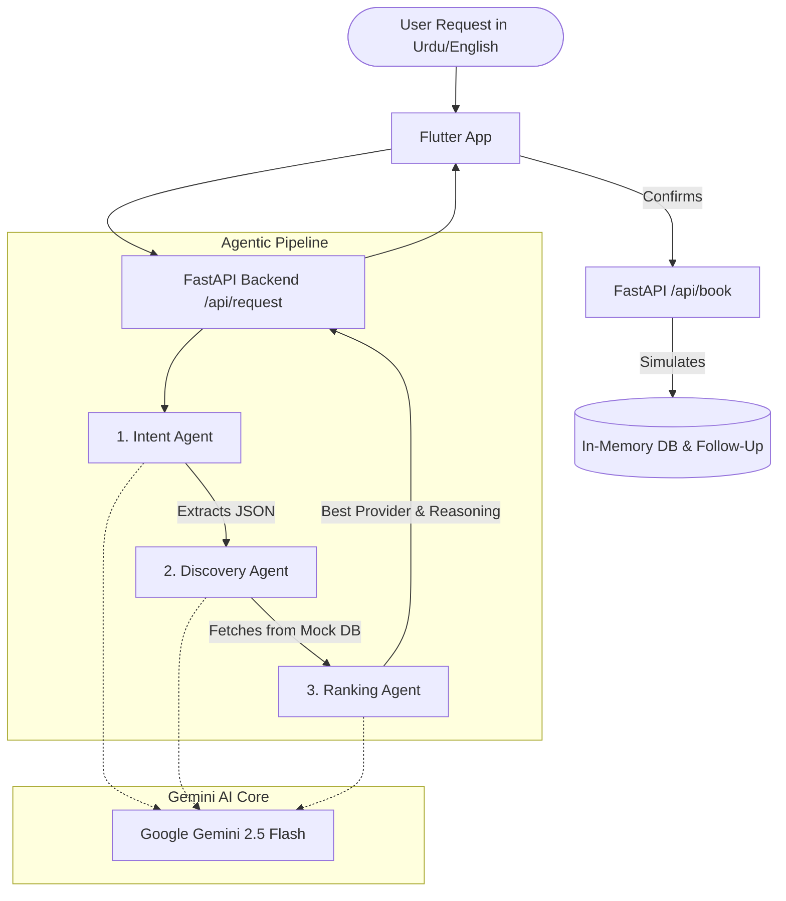

# Khidmat - AI Service Orchestrator (Challenge 2)

**Team Members / Presenters:**
1. Syeda Farzana Shah
2. Areesha Furqan

Khidmat is an Agentic AI System designed to automate the end-to-end lifecycle of a service request in the informal economy. It handles natural language requests (in Urdu, Roman Urdu, and English), identifies relevant service providers, reasons about the best match based on location and ratings, and simulates booking and follow-ups.

## System Architecture

The project follows a decoupled client-server architecture:

1. **Frontend (Flutter Mobile/Web App)**:
   - Provides a conversational UI for users to input service requests in natural language.
   - Displays agent trace logs to provide transparency on AI decision-making.
   - Handles the booking confirmation and UI state.

2. **Backend (FastAPI Python Server)**:
   - Orchestrates the multi-agent workflow.
   - Contains the core logic for the Intent Agent, Discovery Agent, and Ranking Agent.
   - Maintains an in-memory database of mock service providers and simulated bookings.

3. **AI Engine (Google Gemini / Antigravity)**:
   - The core intelligence driving the agents. It structures unstructured text, filters JSON data semantically, and provides reasoned decision-making.

## How Google Antigravity / Gemini is Used

Google Gemini acts as the core orchestration and reasoning platform through a multi-step agent pipeline:

1. **IntentAgent**: Uses Gemini to process natural language input (e.g., "Mujhe kal subah G-13 mein AC technician chahiye"). It extracts the exact `service_type`, `location`, `time_preference`, and `urgency` into a strict JSON schema.
2. **DiscoveryAgent**: Takes the structured intent and cross-references it with a database of available providers. It uses Gemini to intelligently match the intent with the correct provider category and location constraints.
3. **RankingAgent**: Receives the discovered providers and asks Gemini to rank them. Gemini evaluates distance, ratings, and availability, selects the optimal provider, and generates human-readable reasoning (e.g., "Chosen because it is 2km away with a 4.5 rating").

## APIs & Tools Used

- **Google Generative AI SDK (`google-genai`)**: Used for all agentic reasoning and structured JSON output generation.
- **FastAPI (Python)**: High-performance backend framework to serve the API endpoints (`/api/request`, `/api/book`).
- **Pydantic**: Used for defining strict response schemas to ensure the AI agents return reliable data structures.
- **Flutter / Dart**: Used to build a responsive, cross-platform mobile and web application.
- **Uvicorn**: ASGI server for running the FastAPI backend.

## Assumptions & Limitations

- **Mock Database**: The system currently uses a mock dataset (`providers.json`) for service providers instead of live Google Maps/Places API data.
- **Simulated Booking**: The booking action (`/api/book`) is simulated and saves to an in-memory dictionary. Reminders and follow-ups are simulated as static strings generated at the time of booking.
- **Stateless Backend**: Because the backend uses an in-memory dictionary for bookings, all booked state is lost when the server restarts.
- **No Authentication**: User authentication and provider onboarding flows are omitted to focus purely on the agentic orchestration flow.
- **Location Constraints**: Distance calculations are currently mocked within the JSON data rather than being calculated via live GPS coordinates.
